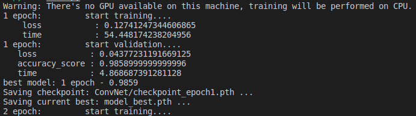

#  Library of pytoan

## Introduction

## Installing
```sh
pip install pytoan
```
## Usage
1. Example model with MNIST
```python
from pytoan.pytorch import Learning
import torch 
import torch.nn as nn
import torchvision
import torchvision.transforms as transforms
from pathlib import Path

# Hyper parameters
num_classes = 10
batch_size = 100
learning_rate = 0.001

# MNIST dataset
train_dataset = torchvision.datasets.MNIST(root='../../data/',
                                           train=True, 
                                           transform=transforms.ToTensor(),
                                           download=True)
test_dataset = torchvision.datasets.MNIST(root='../../data/',
                                          train=False, 
                                          transform=transforms.ToTensor())

train_loader = torch.utils.data.DataLoader(dataset=train_dataset,
                                           batch_size=batch_size, 
                                           shuffle=True,
                                           pin_memory=True)
test_loader = torch.utils.data.DataLoader(dataset=test_dataset,
                                          batch_size=batch_size, 
                                          shuffle=False,
                                          pin_memory=True)

class ConvNet(nn.Module):
    def __init__(self, num_classes=10):
        super(ConvNet, self).__init__()
        self.layer1 = nn.Sequential(
            nn.Conv2d(1, 16, kernel_size=5, stride=1, padding=2),
            nn.BatchNorm2d(16),
            nn.ReLU(),
            nn.MaxPool2d(kernel_size=2, stride=2))
        self.layer2 = nn.Sequential(
            nn.Conv2d(16, 32, kernel_size=5, stride=1, padding=2),
            nn.BatchNorm2d(32),
            nn.ReLU(),
            nn.MaxPool2d(kernel_size=2, stride=2))
        self.fc = nn.Linear(7*7*32, num_classes)
        
    def forward(self, x):
        out = self.layer1(x)
        out = self.layer2(out)
        out = out.reshape(out.size(0), -1)
        out = self.fc(out)
        return out

def accuracy_score(output, target):
    with torch.no_grad():
        pred = torch.argmax(output, dim=1)
        assert pred.shape[0] == len(target)
        correct = 0
        correct += torch.sum(pred == target).item()
    return correct / len(target)

model = ConvNet(num_classes)
criterion = nn.CrossEntropyLoss()
optimizer = torch.optim.Adam(model.parameters(), lr=learning_rate)
scheduler = torch.optim.lr_scheduler.ReduceLROnPlateau(optimizer)
metric_ftns = [accuracy_score]
device = [0]
num_epoch = 100
gradient_clipping = 0.1
gradient_accumulation_steps = 1
early_stopping = 10
validation_frequency = 1
tensorboard = True
checkpoint_dir = Path('./', type(model).__name__)
checkpoint_dir.mkdir(exist_ok=True, parents=True)
resume_path = None
learning = Learning(model=model,
                    criterion=criterion,
                    optimizer=optimizer,
                    scheduler = scheduler,
                    metric_ftns=metric_ftns,
                    device=device,
                    num_epoch=num_epoch,
                    grad_clipping = gradient_clipping,
                    grad_accumulation_steps = gradient_accumulation_steps,
                    early_stopping = early_stopping,
                    validation_frequency = validation_frequency,
                    tensorboard = tensorboard,
                    checkpoint_dir = checkpoint_dir,
                    resume_path=resume_path)

```
2. For Training and Validation
```python
learning.train(train_loader, test_loader)
```

Log:



3. For Testing
```python
learning.test(test_loader) # but not complete
```
